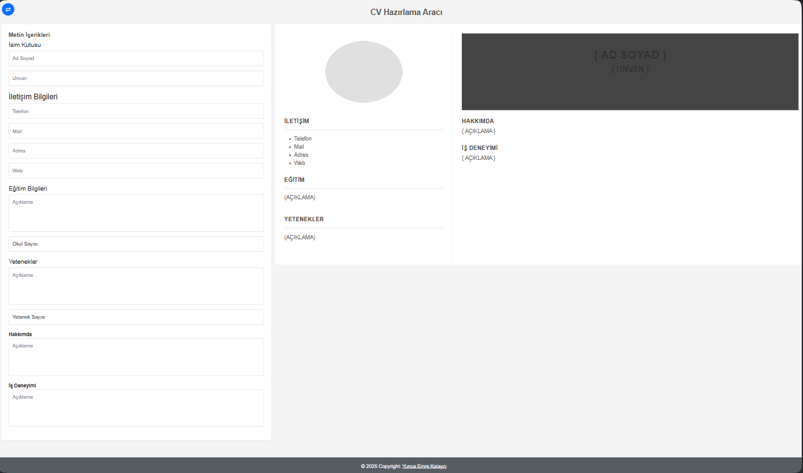
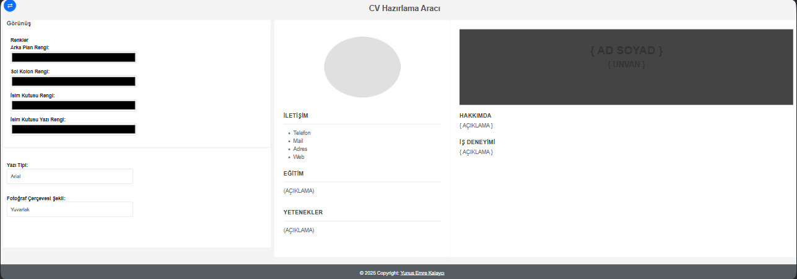
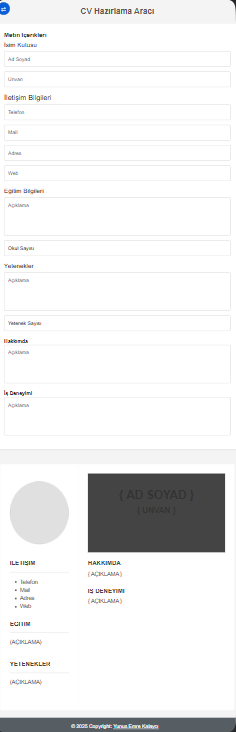

# CV Hazırlama Aracı

Merhaba👋 ben Yunus Emre. Bu projeyi eğitim ve öğrenmek amaçlı geliştirmiş bulunmaktayım

Projemiz kullanıcının girdiği verileri dinamik olarak ön izleme ekranına aktaran bir CV hazırlama aracıdır. Şu an için PDF dönüştürücü özelliği bulunmamaktadır.

## Proje Görselleri

### Tam ekran 1. bölüm


### Tam ekran 2. bölün


### Responsive


## Özellikler
- 👤 Kullanıcı giriş bilgileri: Ad Soyad, Ünvan, İletişim Bilgileri, Eğitim, Yetenekler, Hakkında ve İş Deneyimi.
- 🔄 Dinamik ön izleme: Kullanıcı girişine göre anlık güncellenen CV önizlemesi.
- 🎯 Sade ve kullanışlı arayüz.

## Kurulum
Bu projeyi yerel ortamınızda çalıştırmak için:

1. Projeyi klonlayın:
   ```bash
   git clone https://https://github.com/yekopie/Cv-creator
